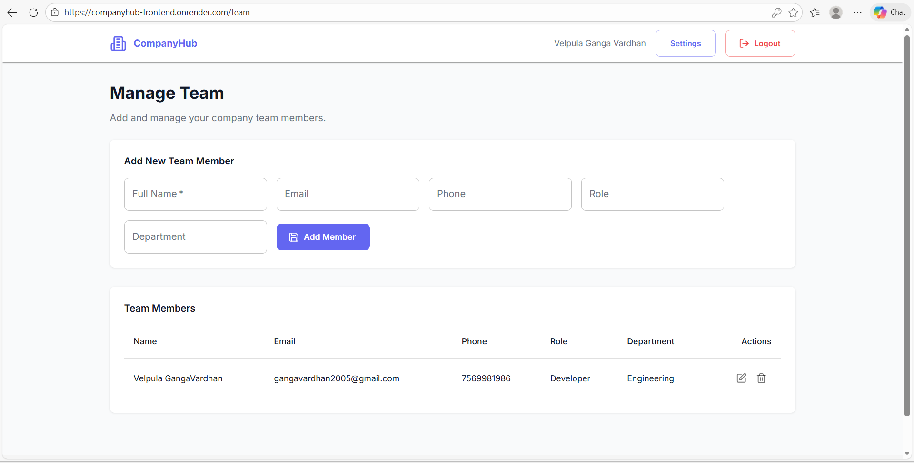
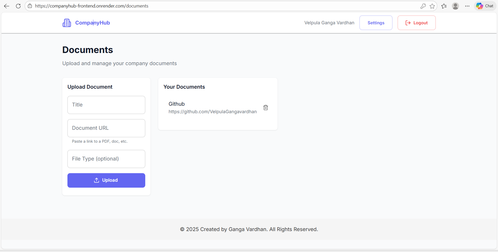

# 🚀 CompanyHub – Business Profile & Registration Portal

A modern, full-stack business registration and company management system built by **Velpula Ganga Vardhan**.  
This project provides a professional dashboard where companies can manage their profile, branding, team members, and documents — all in one place.

⚠️ **Note:** This repository is only a **project preview**.  
The **actual source code (frontend + backend)** is private for security reasons.

---

## 🔗 Live Demo  
👉 https://companyhub-frontend.onrender.com

---

## 📸 Project Preview

### 🖥️ Dashboard

### 🔑 Login Page

### 🏠 Home Page

### 👥 Team Management

### 📂 Document Management

### ⚙️ Settings Page

### 👤 Profile Page

### 📝 Registration Page

---

# ⭐ Overview

**CompanyHub** is a full-stack business management platform designed to simplify digital onboarding for companies.  
It allows users to:

- Manage complete company details  
- Upload official branding assets (Logo + Banner)  
- Add and manage team members  
- Upload official documents  
- Access everything inside a secure dashboard  

This project showcases real-world **full-stack development**, including authentication, CRUD operations, file uploads, cloud hosting, and UI/UX design.

---

# 🎯 Key Features

### 🔐 1. Secure User Authentication
- Login / Register  
- JWT-based auth  
- Protected backend APIs  

### 🏢 2. Company Profile Management
- Upload logo and banner  
- Update company name, industry, address, social links  
- Add company description  
- Auto-preview on dashboard  

### 👥 3. Team Management
- Add team members with role, phone, email  
- Edit / Delete members  
- View everything in real-time  

### 📄 4. Document Management
- Upload PDFs, images, certificates  
- Delete + view files  
- Secure storage using Multer  

### 📊 5. Modern UI Dashboard
- Tailwind CSS + ShadCN UI  
- Smooth navigation  
- Clean and professional interface  

---

# 🛠️ Tech Stack

### Frontend
- React  
- TypeScript  
- Vite  
- Redux Toolkit  
- React Query  
- Tailwind CSS  
- ShadCN UI  
- Axios  

### Backend
- Node.js  
- Express.js  
- PostgreSQL  
- JWT Authentication  
- Multer File Uploads  

### Deployment
- Render (Frontend)  
- Render (Backend)  
- Render PostgreSQL Database  

---

# 📌 Why This Project Matters

This project demonstrates strong full-stack engineering skills:

- Authentication system  
- API integration  
- Database CRUD  
- File uploads  
- Real-world dashboard design  
- Cloud deployment  

It represents a complete production-style business management system.

---

# 👤 Author

### **Velpula Ganga Vardhan**  
Founder – *GangaVardhan Innovations*  
Full-stack developer passionate about building scalable, modern, and meaningful digital solutions.

---

# 🏢 About GangaVardhan Innovations

**GangaVardhan Innovations** reflects a passion for technology, problem-solving, and impactful software engineering.  
The focus is on building:

- Real-world applications  
- Modern dashboards  
- Automation tools  
- Scalable backend systems  

The goal is simple: **create meaningful digital experiences that make an impact**.

---

# 📁 Repository Info

This repository includes:

- ✔️ Project description  
- ✔️ Live demo link  
- ✔️ Screenshots  
- ✔️ Feature overview  

❌ The full source code is not included (kept private).

---

# ⭐ Thank You for Viewing!

If you liked the project, consider giving a ⭐ on GitHub!

